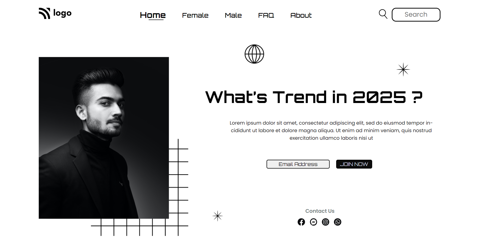

# Work of project 3

In this project the html file is given already and the output image for make this output as it is. And they tell you cannot modify the html file you can only modify the css file. So in this project i can use Position and it's properties,pseudo selectors,flex,margin,padding,color,font-size and font-family etc css properties to make the output.

[Live Link](https://fashion-hub-chi.vercel.app/)

## Here is my Output

